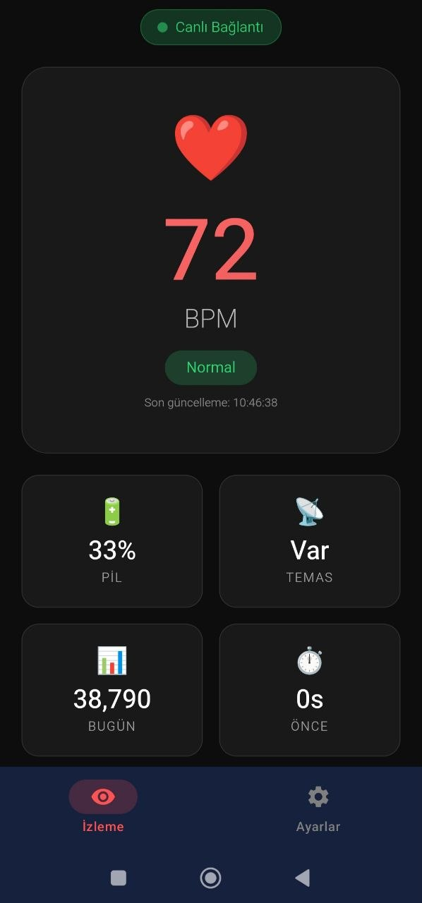
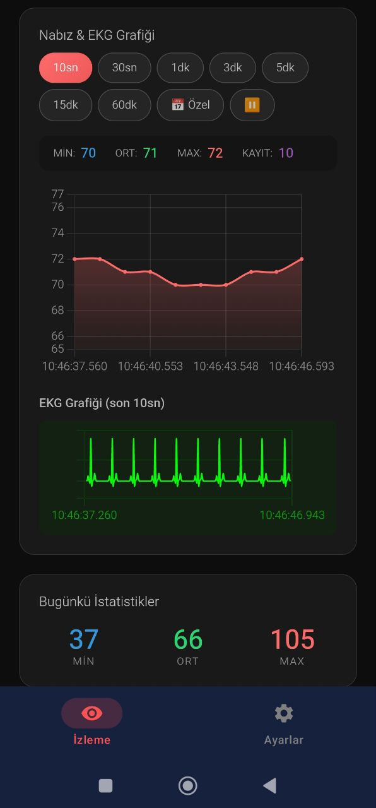
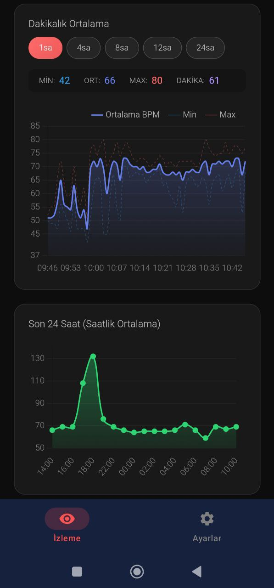
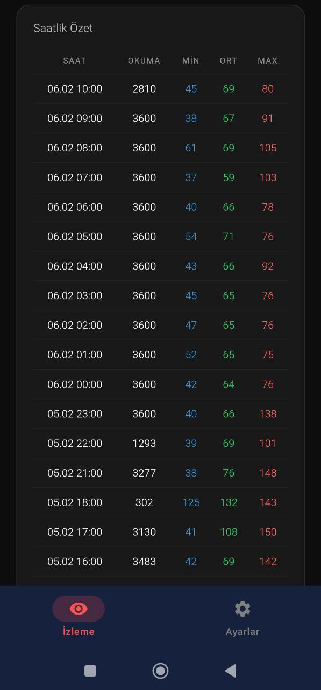
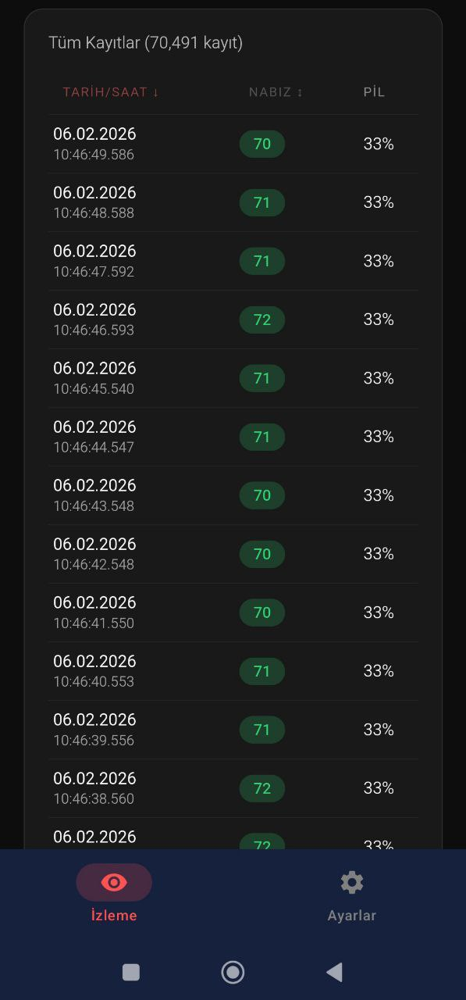
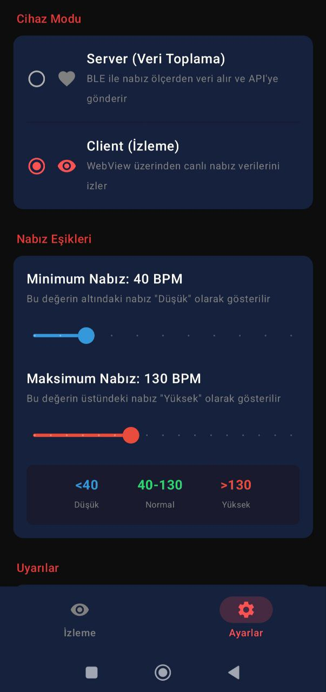
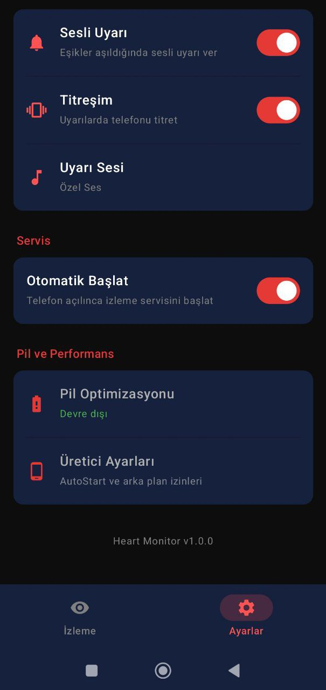
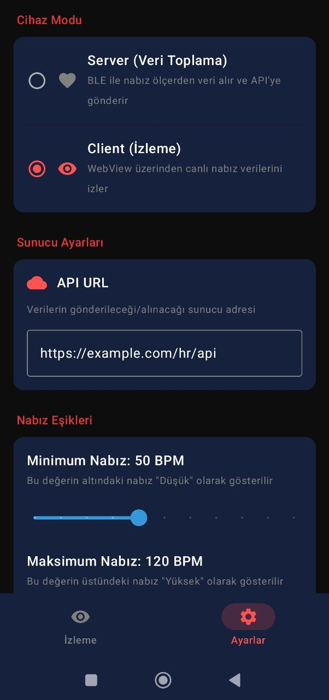

> 🌐 **Dil / Language:** [🇬🇧 English](README.md) | **🇹🇷 Türkçe**

# Real-Time Heart Rate Monitor

Bluetooth Low Energy (BLE) kalp atışı monitörü: Android uygulaması + PHP sunucu. Polar ve diğer BLE uyumlu kalp atışı sensörlerinden gerçek zamanlı veri toplama, sunucuya senkronizasyon ve web dashboard ile canlı izleme.

| Bileşen | Teknoloji | Konum |
|---------|-----------|-------|
| **Android App** | Kotlin, Jetpack Compose | [`app/`](app/) |
| **Web Dashboard** | PHP, Chart.js, SSE | [`server/`](server/) |

## Ekran Görüntüleri

### Canlı Kalp Atışı Ekranı
Ana ekranda BLE sensörden gelen canlı kalp atışı verileri görüntülenir. Bağlantı durumu, batarya seviyesi, sensör teması ve sinyal kalitesi göstergelerini içerir.

<p align="center">
  
</p>

### Grafikler ve Günlük İstatistikler
Kalp atışı grafiği ve RR aralıklarını (EKG benzeri) gerçek zamanlı olarak izleyin. Günlük minimum, ortalama ve maksimum değerler görüntülenir.

<p align="center">
  
</p>

### Saatlik Grafikler
Gün içindeki kalp atışı verilerini saatlik grafiklerle analiz edin.

<p align="center">
  
</p>

### Saatlik Özet Tablosu
Her saat için minimum, ortalama, maksimum değerler ve kayıt sayısını gösteren detaylı tablo.

<p align="center">
  
</p>

### Tüm Kayıtlar
Sunucuya gönderilen tüm kalp atışı kayıtlarını listeleyin ve inceleyin.

<p align="center">
  
</p>

### Cihaz Modu Ayarları
**Server Modu:** BLE sensörden veri toplayıp sunucuya gönderir.
**Client Modu:** WebView üzerinden canlı verileri izler (başka bir cihaz Server modunda çalışırken).

Kalp atışı eşik değerlerini de bu ekrandan ayarlayabilirsiniz.

<p align="center">
  
</p>

### Uyarı ve Servis Ayarları
Eşik aşımlarında titreşim ve ses uyarıları yapılandırın. Arka plan servisi otomatik başlatma seçeneği.

<p align="center">
  
</p>

### API Ayarları
Sunucu URL'si ve API anahtarını yapılandırın. Uygulama kendi sunucunuzla çalışabilir.

<p align="center">
  
</p>

---

## Özellikler

### BLE Bağlantısı
- Wahoo TICKR Fit ve BLE Heart Rate Profile uyumlu cihazlar
- Standart BLE HR Profile kullandığı için diğer sensörlerle (Polar, Garmin vb.) kolayca entegre edilebilir
- Otomatik yeniden bağlantı
- Batarya seviyesi izleme
- Sensör temas algılama
- RR aralıkları (beat-to-beat) okuma

### Veri Analizi
- Gerçek zamanlı kalp atışı grafiği
- RR aralıkları grafiği (EKG benzeri)
- Günlük min/ortalama/maks istatistikleri
- Saatlik detaylı analizler
- Sinyal kalitesi hesaplama (HRV bazlı)

### Sunucu Senkronizasyonu
- REST API üzerinden veri gönderimi
- Offline mod (bağlantı olmadığı zaman yerel kayıt)
- Yapılandırılabilir API URL ve anahtar
- WebView ile canlı izleme (Client modu)

### Uyarılar
- Eşik aşımı bildirimleri (düşük/yüksek nabız)
- Titreşim ve ses uyarıları
- Özelleştirilebilir eşik değerleri

### Arka Plan Servisi
- Foreground Service ile sürekli çalışma
- Pil optimizasyonu yönetimi
- Üretici-özel pil ayarları rehberi
- Otomatik başlatma seçeneği

### Çoklu Dil Desteği
- Türkçe ve İngilizce arayüz
- Sistem diline otomatik uyum
- Ayarlardan manuel dil değiştirme
- Kolayca genişletilebilir yapı (yeni diller eklenebilir)

---

## Gereksinimler

### Android App
- Android 8.0 (API 26) ve üzeri
- BLE destekli cihaz
- Bluetooth, Konum, Bildirim izinleri

### Server
- PHP 8.1+
- MySQL 8.0+ / MariaDB 10.6+
- Apache veya Nginx

---

## Kurulum

### Aşama 1: Server (PHP Backend)

#### 1.1 Repoyu klonlayın

```bash
git clone https://github.com/burakyalti/realtime-heart-rate-monitor.git
cd realtime-heart-rate-monitor
```

#### 1.2 Server dosyalarını web sunucunuza kopyalayın

```bash
cp -r server/ /var/www/html/hr/
```

#### 1.3 Veritabanını oluşturun

```bash
mysql -u root -p < server/schema.sql
```

Bu komut `heart_rate_db` veritabanını ve 3 tabloyu otomatik oluşturur:

| Tablo | Açıklama |
|-------|----------|
| `heart_rate_logs` | Ham nabız verileri (BPM, RR aralıkları, batarya, sensör teması) |
| `heart_rate_alerts` | Eşik aşımı alarmları (düşük/yüksek/sinyal yok) |
| `heart_rate_stats` | Saatlik istatistikler (min, max, ortalama) |

#### 1.4 Ortam değişkenlerini ayarlayın

```bash
cd /var/www/html/hr/
cp .env.example .env
chmod 600 .env
nano .env
```

`.env` dosyasını kendi bilgilerinizle doldurun:

```env
HR_DB_HOST=localhost
HR_DB_NAME=heart_rate_db
HR_DB_USER=your_db_user
HR_DB_PASS=your_db_password
HR_API_KEY=your-secret-api-key
HR_ALLOWED_DEVICES=XX:XX:XX:XX:XX:XX
```

| Değişken | Açıklama |
|----------|----------|
| `HR_DB_HOST` | MySQL sunucu adresi |
| `HR_DB_NAME` | Veritabanı adı |
| `HR_DB_USER` | Veritabanı kullanıcısı |
| `HR_DB_PASS` | Veritabanı şifresi |
| `HR_API_KEY` | Android uygulamanın veri gönderirken kullanacağı güvenlik anahtarı |
| `HR_ALLOWED_DEVICES` | İzin verilen BLE cihaz MAC adresleri (birden fazla: virgülle ayırın) |

#### 1.5 Kurulumu doğrulayın

Tarayıcıdan açın: `https://your-server.com/hr/live.php`

Dashboard yükleniyorsa server kurulumu tamamdır. Henüz veri olmadığı için "Veri yok" mesajı göreceksiniz.

### Aşama 2: Android App

#### 2.1 Uygulamayı Yükleyin

**APK'dan yükleme:**

1. [hr.apk](hr.apk) dosyasını Android cihazınıza indirin
2. "Bilinmeyen kaynaklardan yükleme"ye izin verin
3. Yüklemeyi tamamlayın

**Veya kaynak koddan derleyin:**

```bash
cd realtime-heart-rate-monitor
./gradlew assembleDebug
# APK: app/build/outputs/apk/debug/app-debug.apk
```

#### 2.2 Uygulama Ayarları

1. Uygulamayı açın, **Ayarlar** (sağ üst dişli ikonu) sekmesine gidin
2. **API Ayarları** bölümünden:
   - **API URL:** `https://your-server.com/hr/api/log.php`
   - **API Key:** Aşama 1'de `.env` dosyasına yazdığınız `HR_API_KEY` değeri
3. **Cihaz Modu** bölümünden **Server** modunu seçin
4. Ana ekrana dönüp BLE sensörünüzü bağlayın

Bağlantı kurulduğunda veriler otomatik olarak sunucuya gönderilmeye başlar. `live.php` üzerinden canlı izleyebilirsiniz.

---

## API Endpoint'leri

### Veri Gönderme (Android App → Server)

```
POST /api/log.php
Headers:
  Content-Type: application/json
  X-API-Key: {API_KEY}

Body:
{
  "device_mac": "XX:XX:XX:XX:XX:XX",
  "heart_rate": 72,
  "rr_intervals": [850, 862, 845],
  "battery_level": 85,
  "sensor_contact": true,
  "timestamp": 1699876543210
}
```

### Veri Okuma Endpoint'leri

| Endpoint | Method | Açıklama |
|----------|--------|----------|
| `/api/latest.php` | GET | Son nabız verisi (BPM, batarya, zaman) |
| `/api/chart-data.php?seconds=60` | GET | Grafik verisi (son N saniye) |
| `/api/minute-summary.php?hours=1` | GET | Dakikalık ortalama/min/max (son N saat) |
| `/api/sse.php` | GET | Server-Sent Events (gerçek zamanlı veri akışı) |
| `/api/history.php` | GET | Saatlik istatistik geçmişi |
| `/api/alerts.php` | GET | Alarm geçmişi |

### Canlı Dashboard

```
GET /live.php
```

Web tarayıcısından veya Android Client modundan erişilebilen canlı dashboard:

- Gerçek zamanlı BPM göstergesi (SSE ile anlık güncelleme)
- Kalp atışı ve EKG grafiği (30sn - 60dk aralığında)
- Zaman aralığı seçimi için range slider
- Dakikalık ortalama grafiği (1sa - 24sa)
- Batarya seviyesi ve sinyal durumu

---

## Teknik Detaylar

- **Dil:** Kotlin
- **UI Framework:** Jetpack Compose
- **Minimum SDK:** 26 (Android 8.0)
- **Target SDK:** 35 (Android 15)
- **Mimari:** Single Activity + Compose Navigation
- **BLE:** Android Bluetooth LE API
- **HTTP Client:** Ktor

---

## Proje Yapısı

### Android App
```
app/src/main/java/net/hrapp/hr/
├── MainActivity.kt           # Ana activity ve state yönetimi
├── ble/
│   └── BleManager.kt         # BLE bağlantı yönetimi
├── data/
│   └── PreferencesManager.kt # SharedPreferences yönetimi
├── network/
│   └── ApiClient.kt          # HTTP istekleri
├── service/
│   ├── HeartMonitorService.kt    # Server modu foreground service
│   └── ClientMonitorService.kt   # Client modu foreground service
└── ui/
    ├── components/           # Yeniden kullanılabilir UI bileşenler
    ├── screens/              # Ekran composable'ları
    └── theme/                # Renk ve tema tanımları
```

### PHP Server
```
server/
├── config.php                # Konfigürasyon (.env okuma, DB bağlantısı)
├── live.php                  # Canlı dashboard (SSE, Chart.js, EKG)
├── schema.sql                # Veritabanı şeması (3 tablo)
├── .env.example              # Ortam değişkenleri şablonu
├── .gitignore
└── api/
    ├── log.php               # Veri kaydetme (POST - Android app gönderir)
    ├── latest.php            # Son nabız verisi (GET)
    ├── chart-data.php        # Grafik verisi (GET, ?seconds=N)
    ├── minute-summary.php    # Dakikalık ortalama (GET, ?hours=N)
    ├── sse.php               # Server-Sent Events (gerçek zamanlı akış)
    ├── history.php           # Saatlik istatistikler (GET)
    └── alerts.php            # Alarm geçmişi (GET)
```

---

## Lisans

Bu proje MIT Lisansı altında lisanslanmıştır.

---

## İletişim

Sorularınız veya geri bildirimleriniz için GitHub Issues kullanabilirsiniz.

---

## Sorumluluk Reddi

> **Bu uygulama tamamen kişisel kullanım amacıyla geliştirilmiştir ve tıbbi bir cihaz değildir.**
>
> - Uygulamadaki EKG grafiği, nabız (BPM) verilerinden türetilen **temsili bir görselleştirmedir**. Gerçek bir elektrokardiyogram (EKG/ECG) ölçümü yapmaz.
> - Gösterilen veriler tanı, tedavi veya herhangi bir sağlık kararı için **referans alınmamalıdır**.
> - Sağlık sorunlarınız için her zaman bir sağlık uzmanına başvurun.
>
> Geliştiriciler, bu uygulamanın kullanımından kaynaklanabilecek doğrudan veya dolaylı hiçbir sonuç için sorumluluk kabul etmez.
